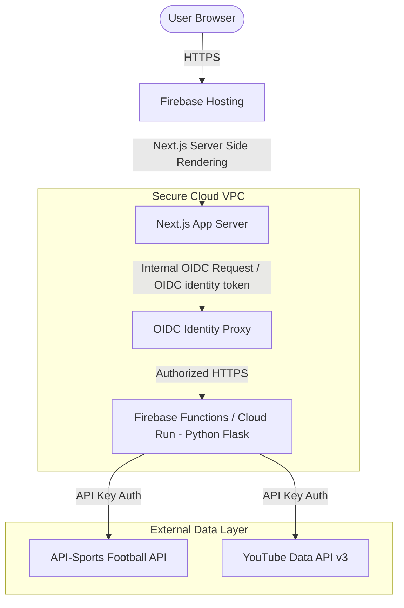

# 🏆 World Cup 2026 Tracking Application

*Author: Kenneth Kinyanjui (Product Manager)*

---

## 🎯 Product Vision & Mission
Our mission is to build the **definitive real-time companion** for the 2026 FIFA World Cup, delivering sub-second match updates, personalized team tracking, and curated media highlights to millions of fans globally. By combining a zero-trust architecture with a blazing-fast user interface, we ensure that fans stay closer to the action than ever before—reliably, securely, and beautifully.

### 📈 Core Success Metrics (KPIs)
*   **Performance**: Under-2-second Initial Page Load (LCP) even under peak load.
*   **Reliability**: 99.99% uptime during active tournament hours.
*   **Latency**: Backend p95 latency under 500ms.
*   **Engagement**: Curated video highlights integrated to increase time-on-page by 25%.

🌐 **Live Deployment**: [https://worldcup26-ioextended.web.app](https://worldcup26-ioextended.web.app)
📚 **Documentation**: [https://kenju254.github.io/worldcup-yami/](https://kenju254.github.io/worldcup-yami/)

---

## ✨ Key Features
*   📅 **Daily Schedule**: Real-time updates on upcoming matches, group alignments, and kick-off countdowns.
*   🏆 **Match Results**: Instant access to final scores, goal scorers, and head-to-head metrics.
*   🌍 **Team Follower**: Personalized tracking for favorite nations. Enter your country (e.g., "USA" or "Argentina") to pin their specific telemetry and upcoming matches to your dashboard.
*   📺 **Highlights Carousel**: Curated video highlights sourced directly via YouTube API to rewatch defining tournament moments.
*   🌓 **Dynamic Theming**: Smooth transitions between Light and Dark mode options matching user preferences.

---

## 🏗️ Architecture at a Glance

The application is architected around a secure, serverless **Zero Trust model** to prevent API key leakage and scrape attacks.



---

## 🛠️ Tech Stack

| Layer | Technology | Reason for Selection |
| :--- | :--- | :--- |
| **Frontend Framework** | Next.js 16 (React 19) | Server components enable fast server-side rendering and keep secrets out of client bundle. |
| **Styling** | Vanilla CSS (Modern CSS Custom Props) | Total control over typography, layouts, and fast execution without framework build overhead. |
| **Backend Gateway** | Flask (Python 3.10) | Lightweight, easy to route, standard for quick microservices. |
| **Serverless Runtime** | Firebase Cloud Functions (Gen 2 / Cloud Run) | Scalable backend execution with auto-scaling to zero to save budget, and scales up to 10 instances to handle match peaks. |
| **Security Layer** | Google Auth Library (OIDC Token) | Restricts backend functions only to authenticated frontend requests, preventing public scraping and billing exploitation. |

---

## 🚀 Getting Started

### Prerequisites
*   **Node.js**: v18.0.0 or higher
*   **Python**: v3.10.0 or higher
*   **Firebase CLI**: Globally installed (`npm install -g firebase-tools`)

### 1. Project Setup & Frontend Installation
Clone the repository and install dependencies:
```bash
npm install
```

### 2. Backend Setup
Navigate to the `functions` directory and set up a Python virtual environment:
```bash
cd functions
python3 -m venv venv
source venv/bin/activate
pip install -r requirements.txt
```

### 3. Environment Configuration
Create environment files using the templates provided:
```bash
# In the functions/ directory, create a .env file:
cp .env.example .env

# Configure the credentials in functions/.env:
# FOOTBALL_API_KEY=your_key
# YOUTUBE_API_KEY=your_key
# CURRENT_SEASON=2022
```

### 4. Running the Application Locally
To start the developer environment:

*   **Frontend Server**:
    ```bash
    npm run dev
    ```
    The application will be available at [http://localhost:3000](http://localhost:3000).

*   **Backend Emulators / Server**:
    You can run Firebase emulators to test functions:
    ```bash
    firebase emulators:start
    ```
    Or run Flask locally directly for rapid development:
    ```bash
    source functions/venv/bin/activate
    python functions/main.py
    ```

---

## 📁 Project Structure

```
worldcup-yami/
├── .github/workflows/       # CI/CD pipelines (CI validation & CD Auto-deploy)
├── .husky/                  # Git hooks (pre-commit lint, pre-push test runner)
├── functions/               # Backend Python/Flask Microservice (Firebase Functions)
│   ├── .env.example         # Example backend secrets
│   ├── main.py              # Main Flask application entrypoint & API endpoints
│   ├── requirements.txt     # Python production dependencies
│   └── requirements-dev.txt # Python developer & testing packages
├── public/                  # Static assets and icons
├── src/
│   ├── app/                 # Next.js App Router pages, layouts, and API proxy routes
│   │   ├── layout.tsx       # Global root HTML wrapper
│   │   ├── page.tsx         # Dashboard landing page container
│   │   └── api/team/[id]/   # Client-to-Backend Next.js authentication proxy
│   ├── components/          # Reusable React components (Schedule, Results, Carousel)
│   │   └── ThemeProvider.tsx# Client theme switching context
│   └── utils/
│       └── api.ts           # Compute-aware OIDC fetching helper
├── firebase.json            # Firebase configuration rules
└── package.json             # Frontend project manifest
```

---

## 🗺️ Product Roadmap
*   **v1.0 (Current)**: Live match dashboard, daily schedules, team follower, video highlights, and theme selection.
*   **v1.1 (Targeted)**: Full CI/CD integration, automated test suites (Jest/Pytest), input sanitization, and response caching.
*   **v1.2 (Planned)**: Live match countdown timers, match event timeline logs, and accessible navigation.
*   **v2.0 (Future)**: Real-time web sockets for goal notifications, user accounts with cross-device favorited teams, and multi-language support (English, Spanish, French).

---

## 🤝 Contributing Guidelines
We welcome contributions to make this project the best it can be!
1.  **Fork** the repository and create a new feature branch (`git checkout -b feature/amazing-feature`).
2.  Ensure your code passes all lint checks (`npm run lint`) and python lint (`flake8`).
3.  Write tests for any new features or bug fixes.
4.  Commit your changes following conventional commits standards.
5.  Push to your branch and submit a Pull Request to the `main` branch.

---

## 📄 License
This project is licensed under the MIT License. See `LICENSE` for details.
