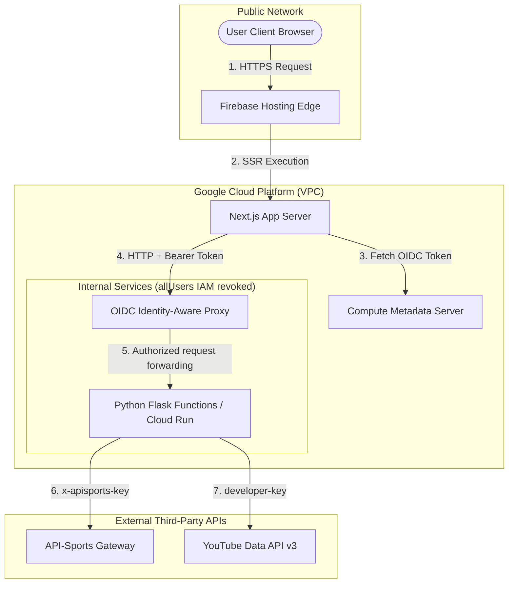
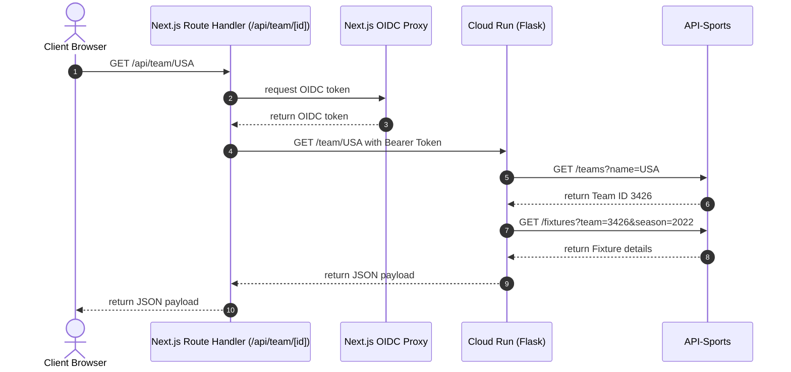

# 🏗️ Architecture Review: World Cup 2026 Tracking Application

*Author: Distinguished Engineer*

---

## 1. System Architecture Diagram

The application utilizes a **Zero Trust Service-to-Service Architecture** to isolate sensitive backend API integrations (such as API-Sports and YouTube) from direct public access.

---

## 2. Component Deep Dive

### 2.1 Frontend: Next.js 16 (React 19)
The frontend utilizes the Next.js App Router and is split into:
*   **React Server Components (RSC)**: `DailySchedule`, `MatchResults`, `HighlightsCarousel`, and `GroupStandings` are executed on the server. They leverage `fetchSecureApi` to obtain data, which keeps the OIDC proxy token resolution and backend API keys completely hidden from the browser.
*   **Client Components**: Components requiring client-side reactivity (such as `ThemeProvider` for local storage settings, `Header` for theme toggles, and `TeamFollower` for form handling) are declared with `"use client"`.

### 2.2 Secure API Proxy
The OIDC helper (`src/utils/api.ts`) automatically detects the execution environment. In production, it utilizes the GCP compute environment's service account to fetch a signed OIDC ID token targeting the backend Flask functions service. In local development (`development` mode), OIDC authentication is bypassed to support rapid local testing using the Firebase emulator or local Flask.

### 2.3 Backend Gateway: Firebase Cloud Functions (Python/Flask)
The backend is built as a Flask microservice deployed on Cloud Run via Firebase Functions (Gen 2). To satisfy Zero Trust requirements, the `allUsers` IAM invoker role is revoked. Only identities with the `roles/run.invoker` IAM role (which is granted specifically to the Next.js server's identity) are authorized to call the endpoints.

---

## 3. Detailed Data Flows

### 3.1 Server-Side Rendering Path (SSR)
1.  User requests page `/`.
2.  Next.js Server executes the root `page.tsx` and parallel async components:
    *   `DailySchedule` fetches `/schedule`
    *   `MatchResults` fetches `/results`
    *   `GroupStandings` fetches `/standings`
    *   `HighlightsCarousel` fetches `/highlights`
3.  For each request, the server fetches an OIDC token and sends a `GET` request to the Cloud Run function.
4.  Next.js compiles the HTML stream and returns a fully rendered page to the user.

### 3.2 Client-Side Interactive Path (Team Follower API Proxy)

---

## 4. Security Architecture & Threat Modeling

| Threat | Risk | Current Mitigation | Proposed / New Mitigation |
| :--- | :--- | :--- | :--- |
| **API Scrape Attack** | High | Zero Trust configuration; direct backend calls rejected. | Restrict CORS in Flask to the production frontend domain only. |
| **Quota Exhaustion** | High | None. Each load calls upstream APIs. | Implement `cachetools` in Flask to cache upstream API payloads. |
| **Token Theft** | Medium | OIDC tokens are short-lived and resolved on server-side. | No action required (tokens never touch user browsers). |
| **Input Injection** | Medium | None. `/team/<team_id>` passed directly to lookup. | Implement strict regex validation for the `team_id` route parameter. |

---

## 5. Reliability & Scalability Analysis

### 5.1 The Caching Gap
Currently, the application operates with **no caching**. Every page reload triggers 4 upstream API calls. Under peak match-day loads, this model introduces two fatal vulnerabilities:
1.  **Upstream Rate Limits**: API-Sports and YouTube quotas will be exhausted rapidly.
2.  **RSC Blocking Latency**: Next.js Server Components wait for the slowest backend call to complete before returning HTML, yielding high time-to-first-byte (TTFB).

**Remediation**: Introduce a server-side `TTLCache` in the Flask backend:
*   `/schedule`: 60s TTL
*   `/results` & `/standings`: 300s TTL
*   `/highlights`: 600s TTL

### 5.2 Error Isolation
Currently, the application handles errors by providing hardcoded fallback data. This hides API errors but makes debugging in production difficult.
**Remediation**:
1.  Standardize Flask error payloads (`{"error": "description"}`).
2.  Implement React **Error Boundaries** around each server component block to ensure one API failure does not crash the entire application dashboard.

---

## 6. Architecture Decision Records (ADRs)

### ADR 001: Zero Trust Service-to-Service Authorization
*   **Status**: Approved
*   **Context**: The application interfaces with paid external API endpoints (API-Sports). Exposing these credentials or allowing unauthenticated backend endpoints risks financial exposure and quota theft.
*   **Decision**: Configure the backend Cloud Run service to deny `allUsers` requests. Frontend server components must obtain and pass an OIDC ID token, signed by Google and validated at the API Gateway level.
*   **Consequences**: Bypasses traditional API-keys/sessions. Requires local development to route through a developer mode (bypassing OIDC) or mock the authenticating proxy.

### ADR 002: Implementation of Server-Side Response Caching
*   **Status**: Proposed (Approved for Revamp)
*   **Context**: The current frontend forces a downstream fetch to the API key owner for every client request, creating potential scaling and budget issues.
*   **Decision**: Implement in-memory TTL caching on the Flask backend.
*   **Consequences**: Data will have a slight propagation delay (up to 5 minutes for standings), but infrastructure stability is significantly increased.

---

## 7. Known Technical Debt
1.  **Hardcoded Target Audience**: `TARGET_AUDIENCE` in `api.ts` is hardcoded as `'https://api-jwiz3cw7wq-uc.a.run.app'`. This should be an environment variable.
2.  **Hardcoded Season**: `CURRENT_SEASON` is hardcoded as `'2022'` in `functions/main.py`. This must be externalized to environment variables and updated for 2026.
3.  **No Test Safety Net**: Zero integration or unit tests for auth wrappers, route proxies, or data mapping functions.
